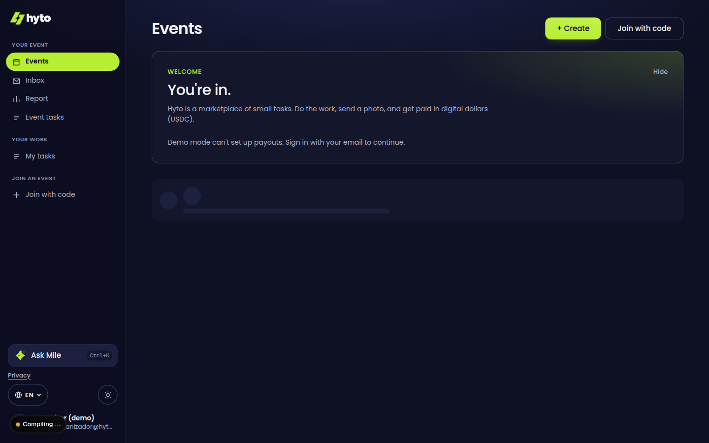
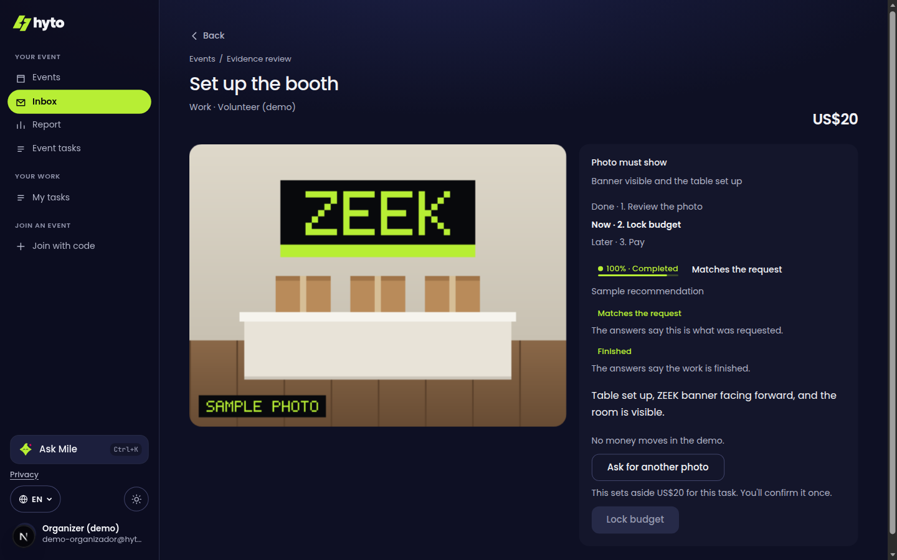
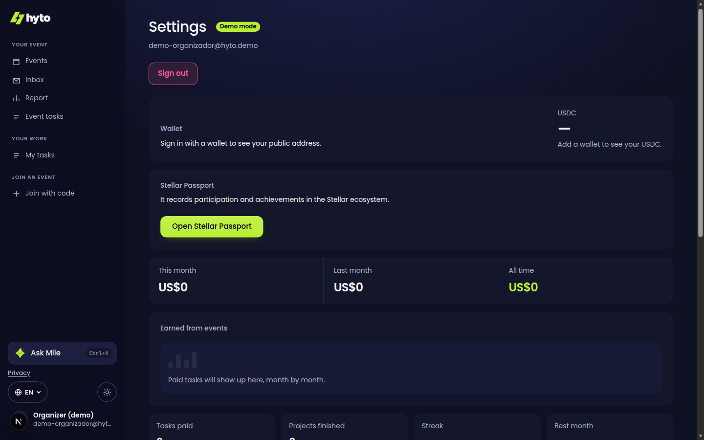

# Hyto

Hyto is the accountability layer for Stellar communities in Latin America: lock USDC per task, prove the spend with a photo, and a person releases the payment on a public trail.

Stellar communities — ambassador programs, local chapters, and builder groups — receive stipends, scholarships (becas), grants, and event sponsorship from abroad, and they have to show how that money was spent. The funder or organizer locks USDC in a Trustless Work escrow for each task. The member does the work and uploads an in-place photo, or a receipt in colones. Mile recommends a score and never moves money. A person releases the payment on Stellar, so the trail is public. Sign-in is an email through Cavos. You do not install a wallet first.

Why USDC, and not a local transfer such as SINPE: the money arrives from abroad in dollars, and the funder wants proof of spending. Trustless Work is the escrow Hyto is built on. It is not a competitor, and Hyto is not an on-ramp.

Try it: https://tryhyto.com. Production deploy: https://hyto.vercel.app. Repo: [Hyto-App/hyto](https://github.com/Hyto-App/hyto).

This file is the short map. Agents and contributors should read [AGENTS.md](AGENTS.md) before changing anything. Stack detail is in [STACK.md](STACK.md). The pitch the team can reuse is in [Hyto-informe.md](Hyto-informe.md).

## Testnet proof

TODO: paste the hash of the first successful testnet USDC payment here, as `https://stellar.expert/explorer/testnet/tx/<hash>`.

No hash is in this repo yet. The pay button prepares a testnet transaction. It does not invent a payment. Amounts in the ZEEK sample (three US$20 work tasks and a meal cap of US$15) are examples in the seed. They are not real money and not real wallets. There is no pilot and no mainnet payment.

## What it does

Login does not pick a global role, and it does not ask for a wallet. A signed-in user who can cover the budget plus a 1 USDC reserve creates an event and becomes that event's organizer. Other people join with a direct invite or a code `HYTO-` plus 12 characters. Invites expire in 7 days. Members see the tasks assigned to them. The organizer sees every task and assigns them at `/eventos/[id]/tareas`.

The shell is Events, Tasks, and Account (light and dark). Evidence is a photo of the work in place, or a receipt. Groq describes it; Laya scores that description when `LAYA_URL` is set. The organizer confirms a reimbursement amount, locks the budget, then pays. The AI never signs.

Communities, the bulletin, account type, and the volunteer profile are the same story: a chapter that holds events, notices when a task moves, and a profile a member writes for themselves. They stay behind `HYTO_COMUNIDADES`, `HYTO_TABLON`, `HYTO_TIPO_CUENTA`, and `HYTO_PERFIL_VOLUNTARIO`. Those flags stay off until their migrations are applied and someone sets the value to `on`.

## Screens

Demo organizer on Events, the review screen (money controls stay off in the demo), and the account with nothing paid yet.







## Run it

```bash
npm ci
npm run dev
npm test
npx tsc --noEmit
npm run build
```

`npm test` runs the `*.test.ts` files under `lib/`, `scripts/backend-traspaso`, and two files in `tests/integracion`, with `tsx`. There is no ESLint and no `npm run lint`. `npm run test:integracion` talks to Postgres and is separate.

```bash
npm run db:local
npm run db:migrar
npm run db:semilla
npm run verificar:entorno
npm run hito
```

`db:migrar` applies `drizzle/*.sql` in filename order. `db:semilla` loads the ZEEK sample. Do not migrate or seed production without the database owner's go-ahead (`HYTO_CONFIRMAR_BASE_PRODUCCION=si` only when that is intended). `npm run hito` is a standalone escrow script; without `TRUSTLESS_API_KEY` it does not pay.

## Deploy

Vercel. A push to `main` deploys production. Every pull request gets a preview. Secrets live in Vercel only, never in the repo. The only `NEXT_PUBLIC_` variable is `NEXT_PUBLIC_CAVOS_APP_ID`.

## Environment

Names only. The full list, taken from `process.env` reads in the app, is in [AGENTS.md](AGENTS.md) and [.env.example](.env.example).

## Docs

| File | What it is |
|---|---|
| [AGENTS.md](AGENTS.md) | Current product, code map, open issues. Read this first. |
| [STACK.md](STACK.md) | Stack and how a payment moves. |
| [ROLES.md](ROLES.md) | Event membership and how the team splits work. |
| [PLAN.md](PLAN.md) | What is left. The September kickoff plan is retired. |
| [CHANGELOG.md](CHANGELOG.md) | What landed. |
| [docs/AUDIT-2026-09-30.md](docs/AUDIT-2026-09-30.md) | Audit against `db82b93`, with a status note for `2b9fad4`. |
| [docs/auditorias/2026-10-02-ramp-adaptation.md](docs/auditorias/2026-10-02-ramp-adaptation.md) | Research on Ramp Network, the crypto on/off-ramp (not the Ramp spend card). Not part of the demo; testnet only. Lands with [#109](https://github.com/Hyto-App/hyto/pull/109). |
